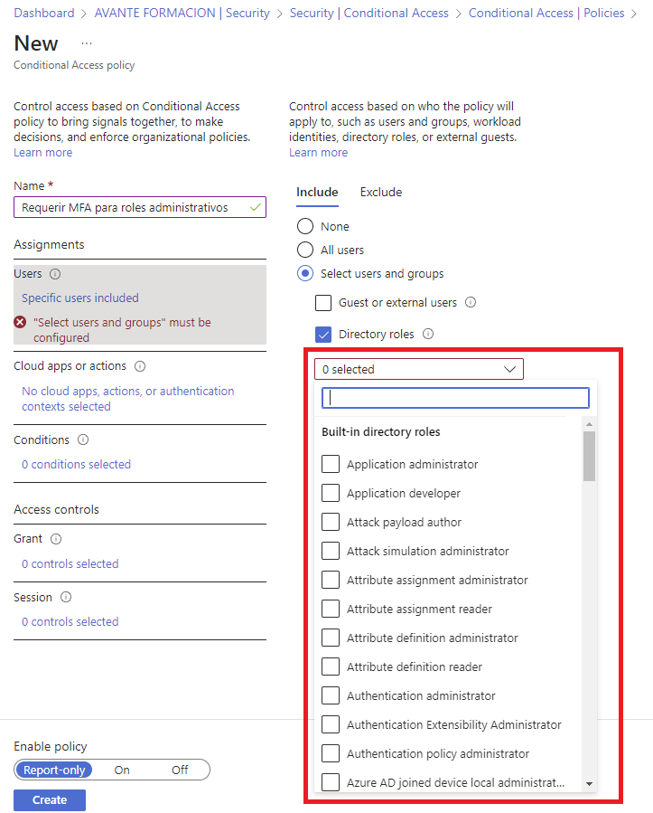

# MFA_para_roles_administrativos.

Esta recomendación de Secure Score en Azure, denominada "Requerir MFA para roles administrativos" tiene un impacto de +17.86% en la seguridad. 

## Descripción. 
Requerir autenticación multifactor (MFA) para todos los roles administrativos hace que sea más difícil para los atacantes obtener acceso a las cuentas. Los roles administrativos tienen permisos superiores a los usuarios normales. Si alguna de estas cuentas se ve comprometida, será posible atacar datos y dispositivos críticos.

## Impacto en los usuarios.
Primero, los usuarios con roles administrativos deben registrarse para la MFA. Después de que se registre cada administrador, las directivas determinan cuándo se les solicitan los factores de autenticación adicionales.

## Implementación

En la página de acceso condicional, hacemos clic en el botón "New Policy".

En nombre escribimos ***Requerir MFA para roles administrativos***.

En ***Asignaciones***, hacemos clic en ***0 users and groups selected*** y elegimos ***Selected users and groups***. Marcamos el check box ***Directory roles***.

Desplegamos el combo para seleccionar los roles.

Elegimos al menos los siguientes roles de administrador.
* Administrador de seguridad
* Administrador de Exchange
* Administrador global
* Administrador de acceso condicional
* Administrador de SharePoint
* Administrador del servicio de asistencia técnica
* Administrador de facturación
* Administrador de usuarios
* Administrador de autenticación

En total seleccionamos 8 roles.

En ***Cloud apps or actions***, seleccionamos ***all cloud apps***.

En ***Cloud apps or actions***, hacemos clic en ***No cloud apps, actions, or authentication contexts selected*** y seleccionamos ***All cloud apps***.

En ***Access controls***, ***Grant***, hacemos clic en ***0 controls selected*** y seleccionamos ***Require multifactor authentication***. Hacemos clic en ***Select***.

En la parte inferior, observar el mensaje que advierte de que no nos bloqueemos a nosotros mismos. Para evitarlo, activamos la política en modo auditoría (***Report-only***). Hacemos clic en ***Create***.

La directiva se ha creado y su estado es ***Report-Only***.

Para determinar el funcionamiento de la directiva vamos a ***Sign-in logs***, en ***Monitoring***.

